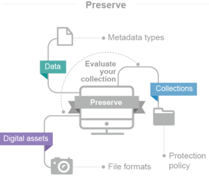
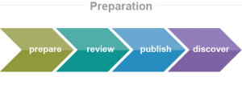
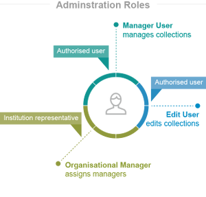
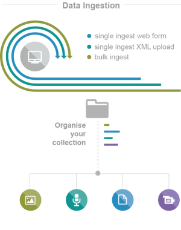
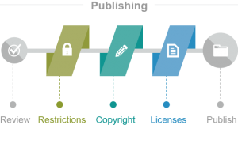
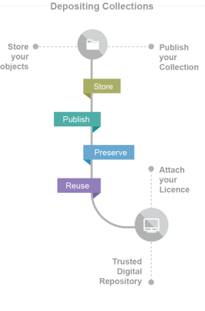

The Data Life cycle
===================

Step 1: Evaluate your Collection
--------------------------------

Assess your collection in terms of DRI’s remit and collection policy. Our collection policy will provide you with an overview of the types of data, digital assets and collections which the Digital Repository of Ireland aims to preserve. You should also review the file formats, metadata and the copyright status of your collection. If your research involves people, you should also review the DRI Restricted Data policy.

**Resources:** 

`DRI Collection Policy (Apr 2020) <https://doi.org/10.7486/DRI.kk91v774c>`_

`DRI Restricted Data Policy (Amended 2019) <https://doi.org/10.7486/DRI.8623xk58w>`_

|
|

Step 2: Data Preparation
------------------------

DRI follows best practice guidelines in terms of digital formats and metadata creation. This allows for interoperability and enhances discoverability in digital repositories. We have developed a series of metadata guidelines for DRI and metadata quality control among others.

Though DRI provides recommendations on formats for ingest, it will ingest non-standard formats, in an effort to balanace best practice with the realities of existing institutional data. DRI staff work closely with new Depositors to encourage the ingest of recommended formats, and will highlight poor format choices early in the Membership phase.

**Resources:**

`DRI Factsheet No. 1: Metadata and the DRI V2 <https://doi.org/10.7486/DRI.bz60sj10d>`_
 
`Dublin Core and the Digital Repository of Ireland: Version 3 (Updated January 2020) <https://doi.org/10.7486/DRI.2z119b06h>`_

`Qualified Dublin Core and the Digital Repository of Ireland: Version 2 (Updated January 2020) <https://doi.org/10.7486/DRI.5425zz83q>`_

`Metadata Quality Control (Apr 2020) <https://doi.org/10.7486/DRI.c821w6752>`_

`DRI Factsheet No. 3: File Formats (Updated November 2018) <https://doi.org/10.7486/DRI.jw82mv08x-1>`_

`EAD, ISAD(G) and the Digital Repository of Ireland (August 2016) <https://doi.org/10.7486/DRI.rj43ck28s>`_

`MODS and the Digital Repository of Ireland (February 2016) <https://doi.org/10.7486/DRI.rr17fb96g>`_

`DRI Batch Metadata Template (2024) <https://doi.org/10.7486/DRI.qn603p95v-8>`_

`DRI Recommended Vocabularies <https://dri.ie/vocabularies>`_

|
|

Step 3: Understanding Adminitrative Roles
-----------------------------------------

DRI have developed policies and procedures to support data ingestion to the repository remotely (via ingest tools) by authorised third parties. Our processes authenticate individuals who wish to deposit data on behalf of their, or another, institution. We use a hierarchy of those “users” that may work on such ingestion processes, and these roles can be set per collection.

**Resources:**

`How to DRI: Understanding Administrative Roles (2018) <https://doi.org/10.7486/DRI.2z1195209>`_

`DRI Depositor Manual: User Roles <https://guides.dri.ie/depositor-guide/01-1-roles.html>`_

`DRI Organisational Manager Agreement (Feb 2018) <https://doi.org/10.7486/DRI.zk527x75s-1>`_

`DRI Deposit Terms and Conditions (Jan 2018) <https://doi.org/10.7486/DRI.1544r4085>`_

`DRI Factsheet No. 5: About DRI Membership (Aug 2016) <https://doi.org/10.7486/DRI.rv04g792m>`_

|
|

Step 4: Ingest Digital Objects
------------------------------

Data ingestion to the Repository happens in three different ways, a single ingest web form, single ingest XML upload and batch ingest upload. Depending on the metadata standard you are using you may need to create a DRI collection first. A collection allows you to organise your digital objects according to your needs (e.g. by subject, by project). A collection may contain different types of digital assets (image, audio, text, etc) which must be accompanied by metadata.

**Resources:**

`DRI Factsheet No. 2: Copyright, Licensing, and Open Access (2021) <https://doi.org/10.7486/DRI.v4066146t>`_

`How to DRI: Protect Your Data (Jun 2015) <https://doi.org/10.7486/DRI.t148tz10k>`_

`How to DRI: Contextual Information <https://doi.org/10.7486/DRI.sn00qc64j>`_

`DRI Guides - Depositing Data <https://guides.dri.ie/depositor-guide/02-2-adding.html#>`_

`DRI Guides - Batch Ingest <https://guides.dri.ie/demos/01-batch-ingest.html>`_

`DRI Batch Metadata Template (2019) <https://doi.org/10.7486/DRI.qn603p95v-8>`_

|
|

Step 5: Publish your Collection
-------------------------------

Once you have reviewed your collection and are satisfied that you have set appropriate access restrictions, copyright statements and licenses, and the metadata for each digital asset is appropriate and accurate, you, or your assigned manager user, can publish your collection. DRI will then mint a digital object identifier (DOI) for each digital object and your collection will be made available to end-users in accordance with the access permissions set (e.g. publically accessible or restricted). All metadata is publicly available and is licensed under CC-BY.

**Resources:**

`How to DRI: Publishing Your DRI Collection (Jun 2015) <https://doi.org/10.7486/DRI.t435vt94n>`_

`DRI Notice and Action Policy (Jan 2014, amended 2017) <https://doi.org/10.7486/DRI.vh5499702>`_

`DRI Factsheet No. 7: Persistent Identifiers and DOIs (April 2021) <https://doi.org/10.7486/DRI.bk12p0477>`_

`DRI Guides - Reviewing and Publishing <https://guides.dri.ie/depositor-guide/04-review-and-publish.html>`_

|
|

Step 6: Preservation and Reuse
------------------------------

Once your collection is published on DRI’s platform, your digital objects are stored in our repository for reliable long term access and preservation. Depending on the licence you attach to your digital objects, others can then reuse these digital objects for their own research. As outlined in our deposit terms and conditions, if a user creates a new data set using digital objects in the DRI, that user is obliged to offer these new data sets for deposit into the Repository. Thus, this new data set can be used for new prospective research, and so the circle continues. Collection owners, as well as authorised third parties, can access the DRI API to reuse digital objects on other sites and services.

**Resources:**

`DRI Factsheet No. 4: Long-term Digital Preservation (Apr 2014) <https://doi.org/10.7486/DRI.rr17fc082-1>`_

