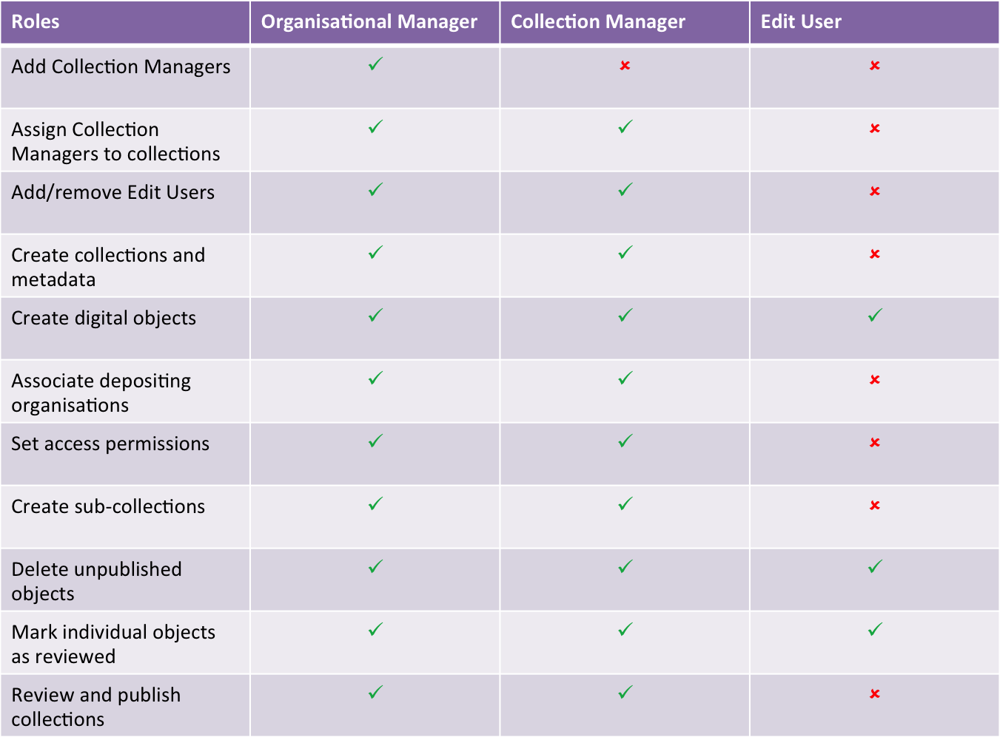

User Roles
===========

The operations that you are allowed perform in the Repository are determined by the
role that your user account has been assigned. There are three main administrative roles that
a user can have.

Organisational Manager
-----------------------
This role has full access rights to collections associated with a depositing organisation. To have
been assigned this role the user must have signed an Organisational Manager agreement. The user, in
this case, is a representative from an organisation. An organisation may have several organisational
managers, each of which may have several collections. The organisational manager can assign collection
managers their collections.

Collection Manager
-------------------
The collection manager role allows a user to create collections and also edit those collections that have been assigned
to them by their organisational manager. An important function of the collection manager is to review and 
publish collections.

Edit User
----------
A user with the Edit User role can add objects to collections that they been have granted access to. They may
also delete unpublished objects and mark objects as 'reviewed'.

The figure below summarises the capabilities of each of these roles.

   Capabilities of user roles

