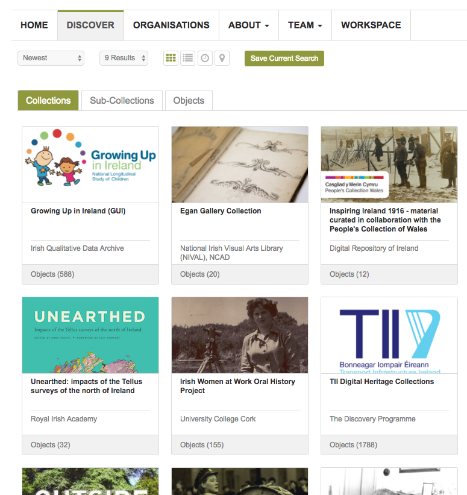

Organise your Collection
=========================

Objects added to the Repository are organised through collections. Every object
must be part of a collection. Collections can optionally  be further divided into sub-collections.
Collections are required regardless of the metadata standard used for the objects.
The metadata that must be associated with a collection is similar to that for an object: Title, 
Date, Creator, Description, Subjects etc. Collections can also be given a cover image that 
represents the collection. Collections can be used to designate particular access permissions 
or licences for the objects they contain.

   Discover by browsing collections

The benefits of organising objects in this way include:

 * Greater visibility for your organisation (one large collection versus multiple collections)
 * Direct researchers to material of interest (e.g., faceting material by type, subjects)
 * Allow researchers to find objects more easily
 * Divide material according to theme, type, funder, project
 * Group together material with similar access conditions
 * Group together material with similar rights or licences

The next section describes how to create these collections and sub-collections.
