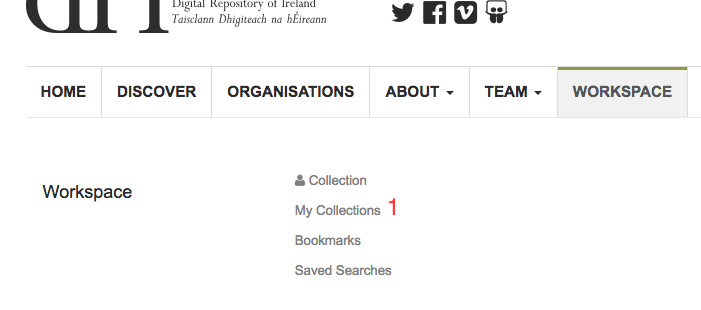
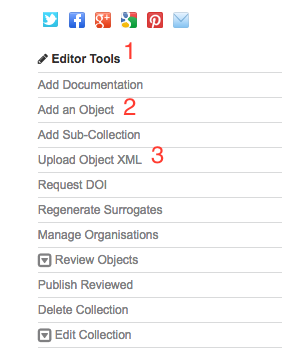
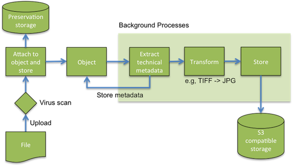
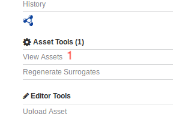
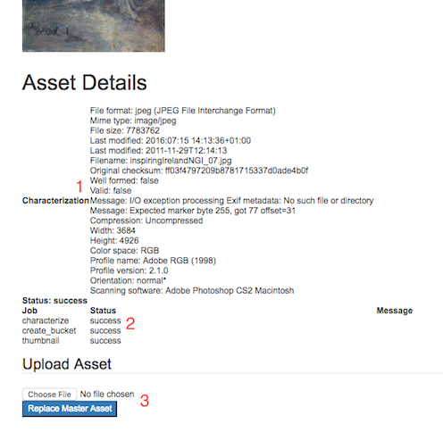

Depositing Data
=================

Adding single objects
----------------------

Adding objects to an existing collection, or sub-collection, is done from the display page for that collection. You can navigate to 
the collection through the 'My Collections' link found in your workspace (:numref:`fig-my-collections` (1)).

.. _fig-my-collections:

   My Collections workspace link

On the right hand side of the collection display page you should see the editor tools menu (:numref:`fig-collection-tools` (1)). There are
two options for adding objects: Add an Object (:numref:`fig-collection-tools` (2)) and Upload Object XML (:numref:`fig-collection-tools` (3)). 
If you have an existing XML metadata file in one of the supported standards then the fastest option is to choose to upload this
to the Repository. If not, you can create the object's metadata using the object creation form.

.. _fig-collection-tools:

   Collection editor tools

The form for creating an object is very similar to that described for creating a collection. You can
get more information on the fields and how they should be completed in 
`DRI's metadata guidelines <http://dri.ie/sites/default/files/files/dri-dublin-core-metadata-guidelines-V2.pdf>`_.

Choosing to upload XML will direct you to the file uploader (:numref:`fig-file-upload` (1)). Clicking on the 
'Upload Metadata file' (:numref:`fig-file-upload` (2)) box will open
a file chooser dialog from which you can pick the XML file to upload. Once a file has been selected, pressing
continue will upload the file and create the object. If successful you will be redirected to the new object's
display page.

.. _fig-file-upload:
.. figure:: images/upload-xml.png
   :alt: Upload XML metadata

   Upload XML metadata

Adding assets to an object
---------------------------

Assets refer to the data that an object's metadata describes, such as image, audio, or video files. From the object's
display page you will have access to the object tools menu. Selecting 'Upload Asset' (:numref:`fig-upload-asset` (1)) will 
open a file chooser from which you can select the file to upload. 

.. _fig-upload-asset:
.. figure:: images/upload-asset.png
   :alt: Upload asset

   Upload asset

Once selected you should now see an 'upload' (:numref:`fig-upload-button` (1)) button to the right of the menu
option. Pressing this will upload the file and attach it to the object.

.. _fig-upload-button:
.. figure:: images/upload-asset-button.png
   :alt: Upload asset button

   Upload asset button

Once uploaded a message indicating if the upload was successful will be displayed. The Repository will now process
the uploaded file for display. For example, in the case of an image, a thumbnail and several other 
web-friendly images of various sizes will be created. This is carried out by a pipeline of background processes (:numref:`fig-background`). 
Until these are completed a temporary message will be shown in the asset display. 

.. _fig-background:

   Asset upload processing pipeline

To check on the progress of these processes you can select View Assets (:numref:`fig-asset-tools` (1)) in the Asset Tools 
menu. 

.. _fig-asset-tools:

   Asset tools menu

This page list all the assets currently attached to the object. Here you can see the current processing status of the asset (:numref:`fig-assets` (1)).
To get more information you can view the asset details (:numref:`fig-assets` (2)). You can also delete the asset (:numref:`fig-assets` (3)).

.. _fig-assets:

   View Assets

On the asset details page (:numref:`fig-asset-details`) you can view the metadata automatically extracted from the uploaded 
file (:numref:`fig-asset-details` (1)). You can also see the progress and status of the background processes (:numref:`fig-asset-details` (2)). This will show if the task has succeeded or in the case of a failure will show the error. You can also choose to replace the asset with a different file (:numref:`fig-asset-details` (3)).

.. _fig-asset-details:

   Asset details

Adding multiple objects
-------------------------

If you have multiple pre-existing metadata records it is also possible to add these as a batch into a collection. To do this it is necessary to arrange the metadata and any data files into a defined folder structure(:numref:`fig-ingest-folder`). Metadata records should be contained in one folder with data in another separate folder. Data files are matched to their metadata record by filename, e.g., ``object_1.jpg`` will be attached to ``object_1.xml``. It is possible to connect multiple data files with a single metadata record by appending an increasing count to the data filenames, e.g., ``object_1_1.jpg``, ``object_1_2.jpg`` would both be associated with ``object_1.xml``.  

.. _fig-ingest-folder:

   Folder structure

The next step is to make the data available to the Repository by copying it to a staging area through the DRI hosted Nextcloud server, that can be found at https://repository.dri.ie/cloud. In Nextcloud create the same folder structure as described above and upload the metadata records and data files.

A wizard (:numref:`fig-ingest-wizard`) that guides you through ingesting the data can be found by following the 'New batch ingest' link in your repository workspace.

.. _fig-ingest-wizard:

   Batch ingest wizard

Pressing 'Create manifest from files' will start the process (:numref:`fig-ingest-wizard` (1)). First, you must select the collection that the data will be added to (:numref:`fig-ingest-wizard` (2)). This must be created in advance. Pressing 'Next' (:numref:`fig-ingest-wizard` (3)) will move to the next step. Here you will see the folders that were created in Nextcloud. Select the folder containing the metadata, press 'Next', and select the folder containing the data files. The next step allows you to optionally select a folder containing preservation data files. These are files that should be attached to metadata records (through matching filenames as before) but not displayed to users, or processed by the background tasks. Pressing 'Complete' will start the ingest and bring you to the ingest status page (:numref:`fig-ingest-status`).

.. _fig-ingest-status:

   Batch ingest status

From the status page you can see the total number of objects that will be ingested (:numref:`fig-ingest-status` (1)), as well as the current number completed. Status information for each object can be seen by following the status count links (:numref:`fig-ingest-status` (2)).
