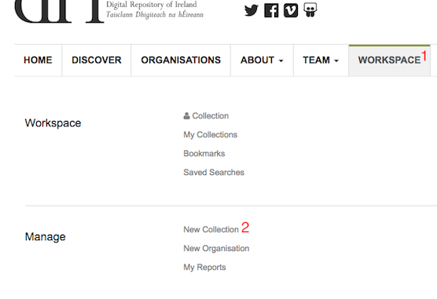
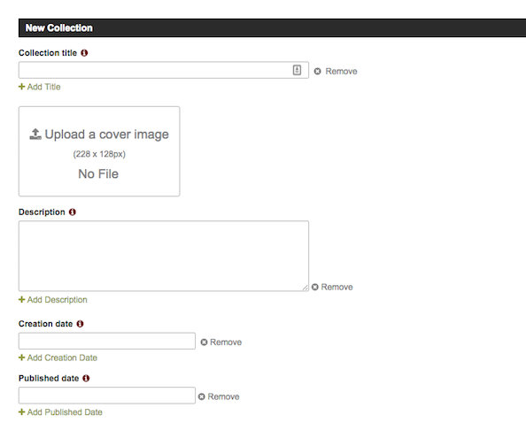
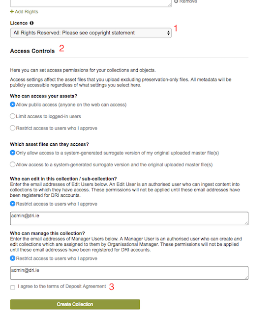

Creating 
=========

This chapter covers how to create collections and their objects in the Repository. It goes on to describe how
to add assets (i.e. files, e.g., images, videos, PDF)  to the objects.

Creating collections
----------------------

The Repository web UI provides two options for creating objects, form entry and XML upload.
In order to use either of these options a collection must exist for the object to be added to.

The ability to create a collection will depend on your level of permissions within the Repository.
If you have the required permissions then in your workspace (:numref:`fig-new-collection` (1)) in the 
Manage section you will be able to see the 'New Collection' (:numref:`fig-new-collection` (2))  option. 

.. _fig-new-collection:

   New collection menu option

If this is not available then it will be necessary for a collection to be created for you and 
that you are granted the correct permissions within this collection to create objects. You should contact 
your Organisation Manager to carry out these tasks on your behalf.

.. _fig-collection-form:

   New collection form

Clicking the 'New Collection' menu item (if available) will bring you to the web form for 
collection creation (:numref:`fig-collection-form`). This form allows you to enter the metadata to describe 
the new collection. The form requires that a minimum set of metadata fields are entered before the collection
can be created. You can also choose a licence (:numref:`fig-submit-collection` (1)) |licencing| to apply to the 
objects within the collection and set the required access controls (:numref:`fig-submit-collection` (2)). Before you 
can submit the form you must check the box (:numref:`fig-submit-collection` (3)) to indicate
that you agree to the terms of the deposit agreement. 

.. |licencing| image:: images/learn-more.png
   :target: https://repository.dri.ie/objects/rb699s72v/files/rf56bp56q/download?type=surrogate

.. _fig-submit-collection:

   Submitting the collection form

Sub-Collections
---------------

If desired collections can be further organised by being divided into sub-collections. The option to create a sub-collection 
can be found on the main collection page under the editor tools (:numref:`fig-editor-tools` (1)).

.. _fig-editor-tools:
.. figure:: images/subcoll_editor_tools.png
   :alt: Collection editor tools

   Sub-collection menu item

This menu item will bring you to a form, similar to that used to create collections, where you can enter the sub-collection's
descriptive metadata. By default a sub-collection will inherit it's access permissions from the parent collection, so the
form does not include the access control section. It is possible to edit these after the sub-collection has been created.

Once created the sub-collection will be displayed on the parent collection page, as shown in :numref:`fig-subcollection-display`.

.. _fig-subcollection-display:

   Sub-collection display

Adding objects
---------------

Adding objects to an existing collection, or sub-collection,  is done from the display page for that collection. You can navigate to 
the collection through the 'My Collections' link found in your workspace (:numref:`fig-my-collections` (1)).

.. _fig-my-collections:
.. figure:: images/my_collections.png
   :alt: My Collections link

   My Collections workspace link

On the right hand side of the collection display page you should see the editor tools menu (:numref:`fig-collection-tools` (1)). There are
two options for adding objects: Add an Object (:numref:`fig-collection-tools` (2)), and Upload Object XML (:numref:`fig-collection-tools` (3)). 
If you have an existing XML metadata file in one of the supported standards then the fastest option is to choose to upload this
to the Repository. If not you can create the object's metadata using the object creation form.

.. _fig-collection-tools:
.. figure:: images/editor_tools.png
   :alt: Collection editor tools

   Collection editor tools

The form for creating an object is very similar to that described for creating a collection. You can
get more information on the fields and how they should be completed in 
`DRI's metadata guidelines <http://dri.ie/sites/default/files/files/dri-dublin-core-metadata-guidelines-V2.pdf>`_.

Choosing to upload XML will direct you to the file uploader (:numref:`fig-file-upload` (1)). Clicking on the 
'Upload Metadata file' (:numref:`fig-file-upload` (2)) box will open
a file chooser dialog from which you can pick the XML file to upload. Once a file has been selected, pressing
continue will upload the file and create the object. If successful you will be redirected to the new object's
display page.

.. _fig-file-upload:
.. figure:: images/upload-xml.png
   :alt: Upload XML metadata

   Upload XML metadata

Adding assets
--------------

Assets refer to the files that an object's metadata describes, such as image, audio, or video files. From the object's
display page you will have access to the object tools menu. Selecting 'Upload Asset' (:numref:`fig-upload-asset` (1)) will 
open a file chooser from which you can select the asset to upload. 

.. _fig-upload-asset:

   Upload asset

Once selected you should now see an 'upload' (:numref:`fig-upload-button` (1)) button to the right of the menu
option. Pressing this will upload the asset and attach it to the object.

.. _fig-upload-button:
.. figure:: images/upload-asset-button.png
   :alt: Upload asset button

   Upload asset button

Once uploaded a message indicating if the upload was successful will be displayed. The Repository will now process
the uploaded asset for display. For example, in the case of an image, a thumbnail and several other 
web-friendly images of various sizes will be created. This is carried out by a pipeline of background processes (:numref:`fig-background`). 
Until these are completed a temporary message will be shown in the asset display. 

.. _fig-background:
.. figure:: images/background_jobs.png
   :alt: Background processes triggered by asset upload

   Asset upload processing pipeline

To check on the progress of these processes you can select Asset Details (:numref:`fig-asset-tools` (1)) in the Asset Tools 
menu (:numref:`fig-asset-tools` (2)). You can also delete the asset from this menu (:numref:`fig-asset-tools` (3)).

.. _fig-asset-tools:
.. figure:: images/asset-tools.png
   :alt: Asset tools menu

   Asset tools menu

On the asset details page (:numref:`fig-asset-details`) you can view the metadata automatically extracted from the uploaded 
asset (:numref:`fig-asset-details` (1)). You can also
see the progress and status of the background processes (:numref:`fig-asset-details` (2)). This will show if the task has 
succeeded or in the case of a failure will show the error. You can also choose to replace the asset with a different 
file (:numref:`fig-asset-details` (3)).

.. _fig-asset-details:
.. figure:: images/asset-details.png
   :alt: Asset details

   Asset details

