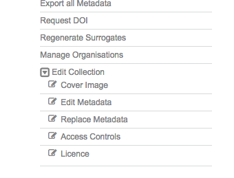
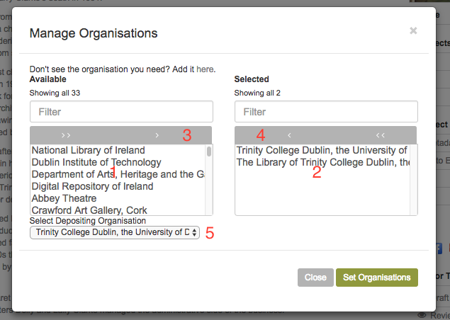
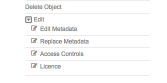

Editing 
========

This chapter describes the various editor tools available for objects and collections.

Collections
------------

The available options for editing a collection can be found in the editor tool menu 
'Edit Collection' dropdown. The content of this dropdown will vary depending on
the role that has been granted to your user account.

   Edit collection menu

The options for editing are:
 * **Cover image** if a cover image is added to the collection it will be displayed in search results
 * **Edit metadata** edit the collections descriptive metadata using form entry
 * **Replace metadata** replace descriptive metadata by uploading an XML metadata file
 * **Access controls** edit the collections access controls
 * **Licence** choose a licence to apply to the objects contained in the collection. The selected licence
   will be displayed on the object pages

It is also possible to associate organisations with the collection by selecting 'Manage Organisations' from the
editor tools. In the Manage Organisations modal there are two lists, the available organisations on the left (1)
and those that are currently associated with the collection on the right (2). Move organisations between the lists
by selecting them and using the right (3) and left (4) arrows. At least one of the associated organisations should be set as the
depositing organisation by selecting the organisation in the depositing organisation drop down (5). 
Save your changes by pressing 'Set Organisations'.

   Manage organisations

Once set, the logos of the associated organisations will be displayed in the
Organisations and Sponsors section of the collection page.

   Organisation logos displayed

Objects
--------

As with collections, the options for editing an object can be found in the Edit section of the Editor Tools menu.
The options may be different depending on your level of access.

   Edit object menu

The options for editing are:
 * **Edit Metadata** edit the object's descriptive metadata using form entry. This is not available for EAD
 * **Replace Metadata** replace the descriptive metadata by uploading an XML file
 * **Access Controls** edit the object's access controls. **Note** permissions set here will override those set at collection level
 * **Licence** you can set a different licence at object level. **Note** this will override the licence set at collection level

