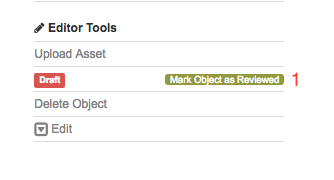

Reviewing and Publishing
=========================

This chapter describes how to review objects and publish collections. Publishing collections
(i.e., making them publicly viewable) is a two step process.

Reviewing
----------

Setting the status of an object to *reviewed* indicates that editing of the descriptive metadata has been 
completed. Also that any attached assets are displaying correctly and all background
processes have finished. Individual objects can be set as reviewed from the object Editor Tools menu (1).

   Review individual object

Alternatively it is possible to set all draft objects contained within a collection and it's sub-collections to reviewed using the 
collection Editor Tools menu (2). This section of the menu provides a summary of the number of sub-collections
and objects by status, either *draft*, *reviewed* or *published*.

   Mark all objects as reviewed

Changing the status of the objects is carried out in a background process that could take some time to complete.
You should be able to see the status counts change from draft to reviewed as this takes place.

Publishing
-----------

The second step is to publish the reviewed objects. This operation can only be carried out by an Organisational or Collection Manager and 
must be done from the top level collection. As such this will publish all reviewed objects contained within it, including those in sub-collections. If the status summary information shows that there are reviewed sub-collections and objects they can be published
by pressing the publish button (1). 

   Mark all objects as published

Again this will be carried out in the background and depending on the number of objects could
take some time to complete. As part of the publishing process a DOI will be minted for the object, which once publishing is complete
will be visible in the object's citation. This DOI will be **permanently accessible** and as such it is important that an object is checked
thoroughly prior to being published.

