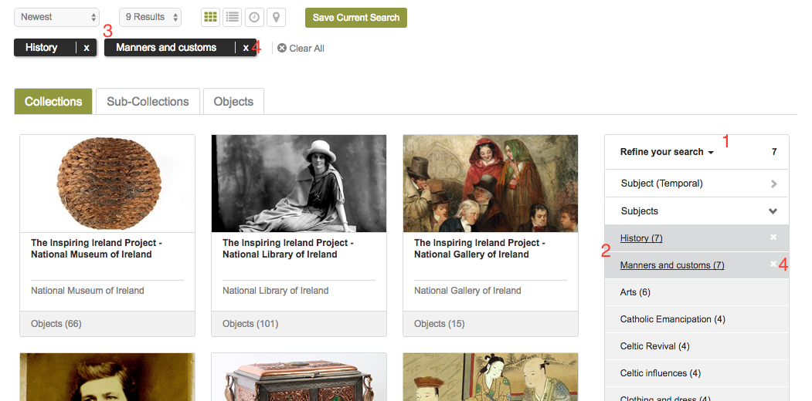

Navigating the Repository
==========================

From the Repository homepage you can navigate to all sections of the site. You can choose to view
one of the featured collections or objects, or to see all collections available 
follow the 'Discover' link in the navigation bar.

Browsing
---------
'Discover' (1) brings you to the main search page of the Repository.

.. figure:: images/discover.png
   :alt: Discover page screenshot

   Discover page

The first tab, selected by default, displays the collections in the Repository. You can browse the available collections
using the pagination links in the top right (2). You can reduce the number of collections or objects displayed 
with the facet bar (3) on the right. Click to expand the options and choose the terms that you would like to view.

Some of the collections in the Repository include sub-collections within them. If you would like these
to be shown together with the collections click the Sub-Collections tab (4). To hide them simply click the tab
again.

Selecting the Objects tab will display the objects contained within the collections returned by the current search.

Searching
----------
The search box can be used to find collections or objects containing particular terms within their descriptive metadata.
To search for simple combinations of words simply type them into the box and press enter. By default individual words
in the search will be joined with AND, meaning that the search will look for metadata containing all the words entered.

You can also search for metadata containing any of the words by using an OR operation, e.g., Dublin OR Galway.

To search for specific phrases enclose the search in quotes, e.g., "Easter Rising".

   Search box

The results of your search can be further refined using the facet bar (1). Clicking on a facet within the bar will
expand the available filtering options (2). Select one or more of these options and the filtered results will be
displayed. The selected filters will be shown at the top of results display (3). Filters can be removed
from the search by clicking the white X in either the facet bar or beside the filter (4).

   Refining a search with the facet bar

It is possible to change the layout of the results from the default grid view to a list using the buttons
at the top of the results display. There are also options for a map and timeline display.

.. figure:: images/list-results.png
   :alt: Viewing results as list

   Search results with list display selected.

Viewing
--------

On the object display pages there are a number of tools available. The options listed will depend on whether you
are viewing a collection or an object.

.. figure:: images/collection-display.png
   :alt: Collection display page

   Collection display page.

The collection display shows the metadata describing the collection. In the right hand sidebar there is a link that
will return all the objects contained in the collection as a search result (1). A list of links to objects grouped by type 
is also shown (2). In the Object Tools menu there is a link to display a citation (3). The citation will contain
the Digital Object Identifier assigned to the collection (if the collection has been published). The link to the full metadata (4)
will display the metadata used to create the collection in its original standard. You can download the metadata in XML format
from the full metadata dialog (1).

   Full metadata dialog.

The object display page also contains the object tools menu, allowing you to view the full metadata of the object and to view
a citation. The object display also contains a viewer (1) for any assets attached to the object. The type of display will vary
depending on the asset type. For example, if the asset is an audio file an audio player will be shown. Images will be displayed
here also. Clicking on the image (2) will display a larger version in a separate dialog. If there are multiple assets attached to the
object arrows (3) will be shown to allow you to scroll between them. You can choose to download a surrogate of each asset, and possibly also the original master asset (depending on permissions) from the download modal that can be opened with the download link (4).

   Asset viewer.
