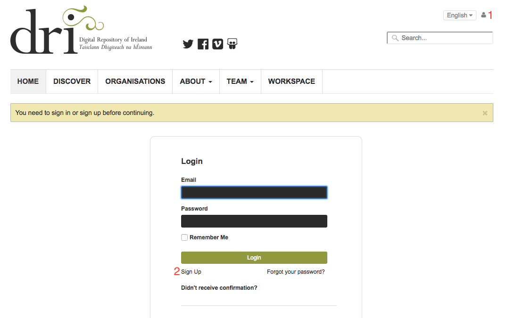

Get Started
===========

This chapter describes how to get started with the Repository. It covers
how to navigate the site and create an account.

End user agreement
------------------

When you visit the Repository for the first time you will see the DRI End User Agreement (:numref:`fig-agreement`).
In order to continue to the site you must choose to agree with this. Should you not agree 
you will be re-directed to the DRI website.

.. _fig-agreement:
.. figure:: images/end-user.png
   :alt: End User Agreement

   End User Agreement

Choosing a language
-------------------

It is possible to view some sections of the Repository in either the Irish or English language. To toggle
between languages use the drop-down menu in the top right (:numref:`fig-language` (1)) if available.

.. _fig-language:
.. figure:: images/language-menu.png
   :alt: Language menu

   Language selection menu

Creating an account
-------------------

Searching and viewing public collections and objects can be done without having an account on the Repository.
Some functions, however, are only available to registered users |learnusers|.

.. |learnusers| image:: images/learn-more.png
   :target: http://dri.ie/sites/default/files/files/HowtoDRI_UserRoles%20v2.pdf

To create an account you should click the user profile link (:numref:`fig-sign-in` (1)) in the top right navigation menu, which will redirect you to the sign-in form.  Clicking on 'Sign up' (:numref:`fig-sign-in` (2)) will bring you to the registration form.

.. _fig-sign-in:

   Sign-in form.

You must enter your name, email address and set a password.
It is important the email address entered is valid and accessible by you. Once the required information has 
been entered the form is submitted by clicking the 'Register' button (:numref:`fig-registration` (1)).

.. _fig-registration:
.. figure:: images/registration.png
   :alt: Registration form

   Registration form.

You should see a confirmation message stating that an email has been sent to the address entered on the form.
This email will contain a link that you must visit to confirm your new account. Once you have done this
your account will be confirmed and activated and you can now sign in.

To sign in click the user profile link (:numref:`fig-profile` (1)), which will bring you to the sign in form. Enter the email address and password for the account just created and click 'Login'. If successful you will be redirected to your profile page. This page allows you to view and edit (:numref:`fig-profile` (2)) your user profile. You can also log out by clicking on the 'Log Out' button (:numref:`fig-profile` (3)).

.. _fig-profile:
.. figure:: images/signed-in.png
   :alt: Signed in screenshot

   Successful sign in.
