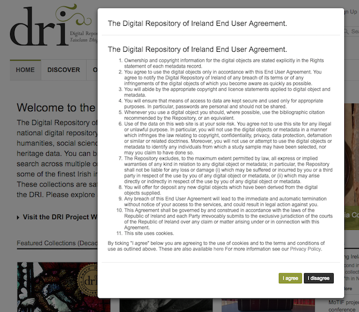
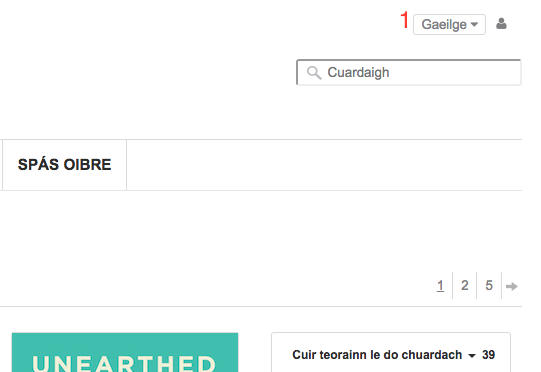
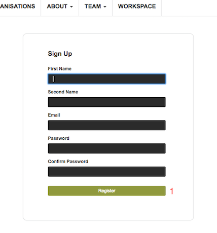
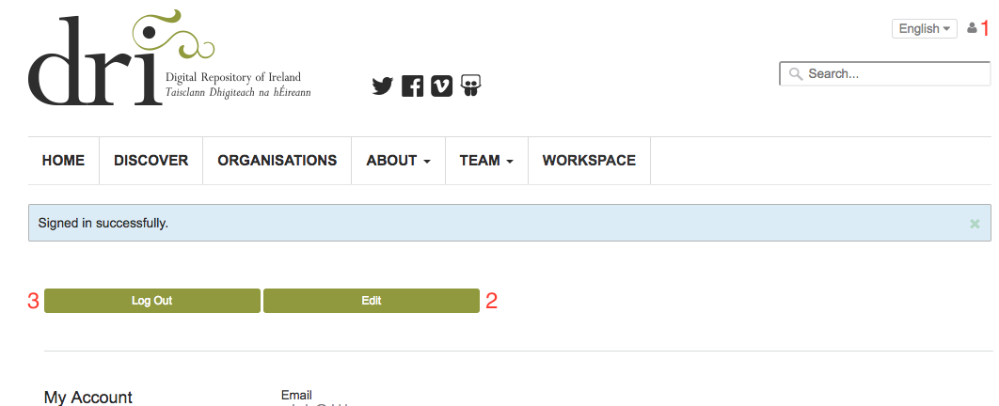

Get Started
===========

This chapter describes how to get started with the Repository. It covers
how to navigate the site and create an account.

End user agreement
------------------

When you visit the Repository for the first time you will see the DRI End User Agreement.
In order to continue to the site you must choose to agree with this. Should you not agree 
you will be re-directed to the DRI website.

   End User Agreement

Choosing a language
-------------------

It is possible to view the Repository in either the Irish or English language. To toggle
between languages use the drop-down menu in the top right (1).

   Language selection menu

Creating an account
-------------------

Searching and viewing public collections and objects can be done without having an account on the Repository.
Some functions, however, are only available to registered users |learnusers|.

To create an account you should click the 'Sign Up' link (1) in the top right navigation menu.
This will bring you to the registration form. You must enter your name, email address and set a password.
It is important the email address entered is valid and accessible by you. Once the required information has 
been entered the form is submitted by clicking the 'Register' button (2).

   Registration form.

You should see a confirmation message stating that an email has been sent to the address entered on the form.
This email will contain a link that you must visit to confirm your new account. Once you have done this
your account will be confirmed and activated and you can now sign in.

To sign in click the 'Login' link, which will bring you to the sign in form. Enter the email address and password
for the account just created and click 'Login'. You will be redirected to the Repository home page and should see
some additional menu options. You can view and edit your user profile by clicking on the user symbol in the top right
navigation bar (1).

   Successful sign in.
