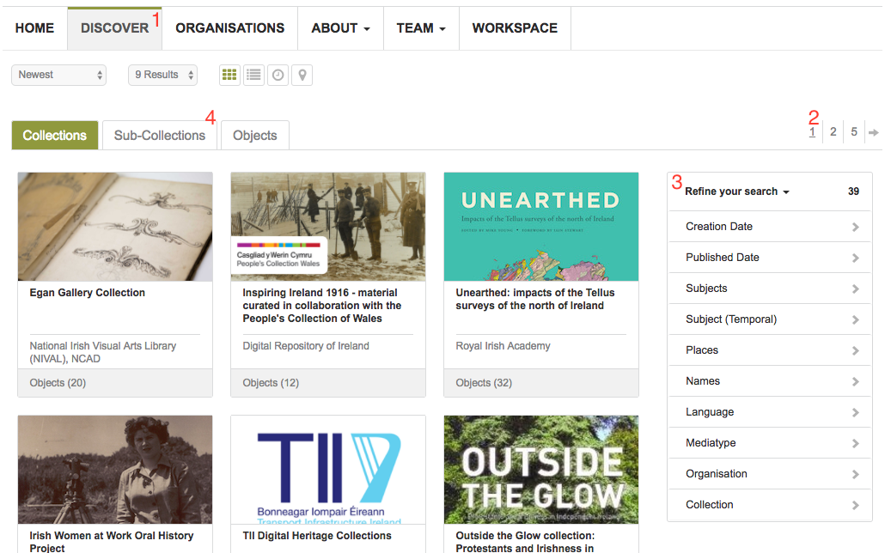
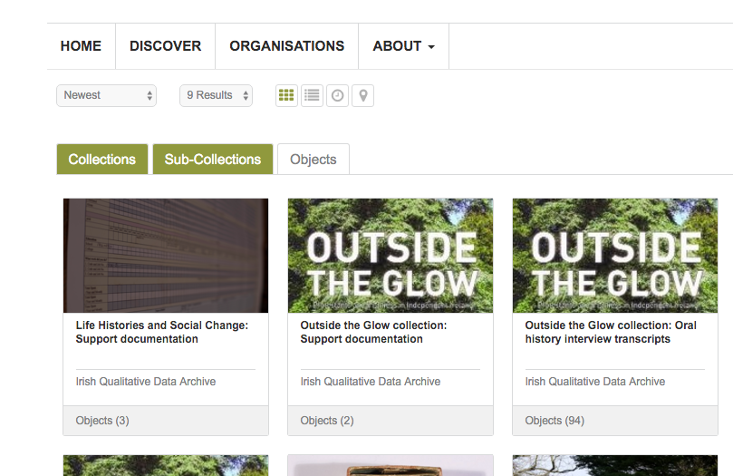
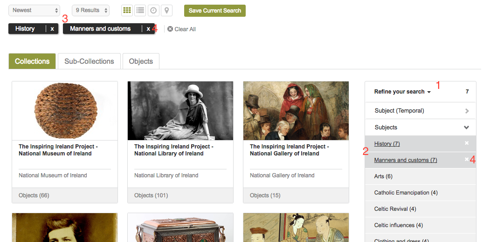
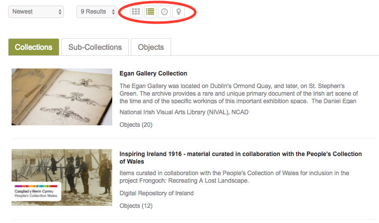

Get Started
===========

This chapter describes how to get started with the Repository. It covers
how to navigate the site and create an account.

End user agreement
------------------

When you visit the Repository for the first time you will see the DRI End User Agreement.
In order to continue to the site you must choose to agree with this. Should you not agree 
you will be re-directed to the DRI website.

.. figure:: images/end-user.png
   :alt: End User Agreement

   End User Agreement

Navigating the site
-------------------

From the Repository homepage you can navigate to all sections of the site. You can choose to view
one of the featured collections or objects, or to see all collections available 
follow the 'Discover' link (1) in the navigation bar.

'Discover' brings you to the main search page of the Repository.

   Discover page

Initially the search results displayed are all collections available. Use the pagination links in 
the top right (2) to navigate the results. Your search can be refined using the facet bar (3) on the right.
Some of the collections in the Repository include sub-collections within them. If you would like these
to be included in the displayed results click the Sub-Collections tab (4). To hide them simply click the tab
again.

   Discover page including sub-collections

Selecting the Objects tab will allow for searching all the objects available in the Repository.

As stated you can filter the results of your search using the facet bar (1). Clicking on a facet within the bar will
expand the available filtering options (2). Select one or more of these options and the filtered results will be
displayed. The selected filters will be shown at the top of results display (3). Filters can be removed
from the search by clicking the white X in either the facet bar, or beside the filter (4) in the list 
above the results. 

   Refining a search with the facet bar

It is possible to change the layout of the results from the default grid view to a list using the buttons
at the top of the results display. There are also options for a map and timeline display.

   Search results with list display selected.

Creating an account
-------------------

Searching and viewing public collections and objects can be done without having an account on the Repository.
Some functions, however, are only available to registered users |learnusers|.

.. |learnusers| image:: images/learn-more.png
   :target: http://dri.ie/sites/default/files/files/HowtoDRI_UserRoles%20v2.pdf

To create an account you should click the 'Sign Up' link (1) in the top right navigation menu.
This will bring you to the registration form. You must enter your name, email address and set a password.
It is important the email address entered is valid and accessible by you. Once the required information has 
been entered the form is submitted by clicking the 'Register' button (2).

.. figure:: images/registration.png
   :alt: Registration form

   Registration form.

You should see a confirmation message stating that an email has been sent to the address entered on the form.
This email will contain a link that you must visit to confirm your new account. Once you have done this
your account will be confirmed and activated and you can now sign in.

To sign in click the 'Login' link, which will bring you to the sign in form. Enter the email address and password
for the account just created and click 'Login'. You will be redirected to the Repository home page and should see
some additional menu options. You can view and edit your user profile by clicking on the user symbol in the top right
navigation bar (1).

.. figure:: images/signed-in.png
   :alt: Signed in screenshot

   Successful sign in.
