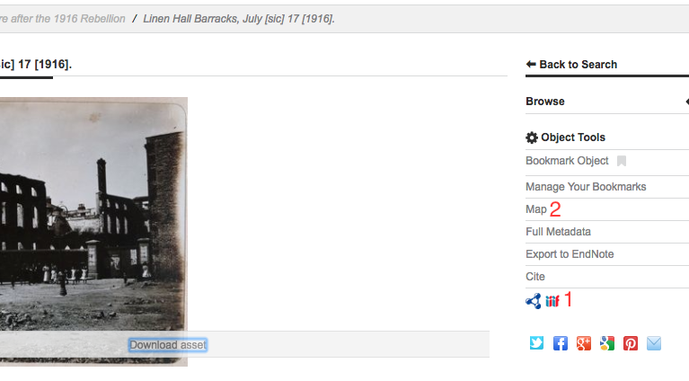
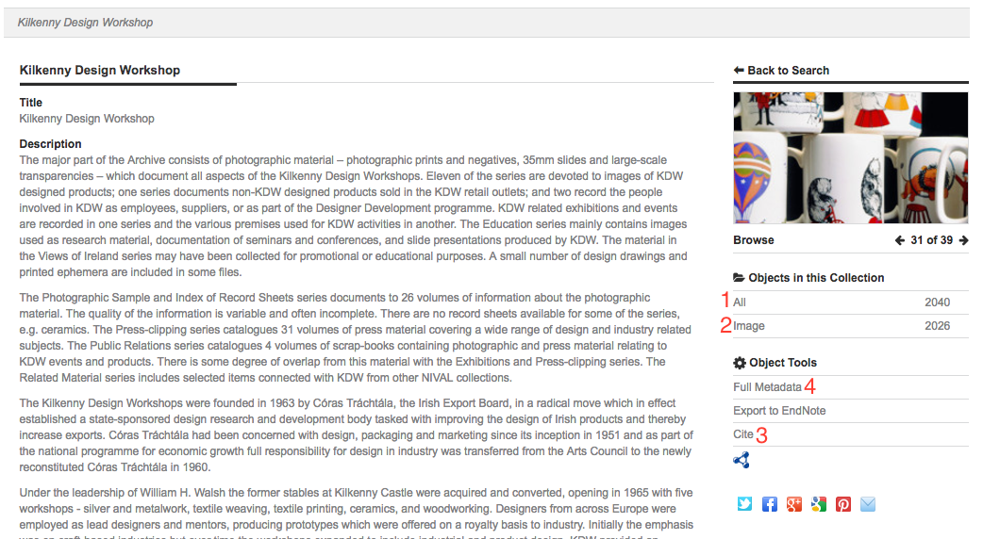
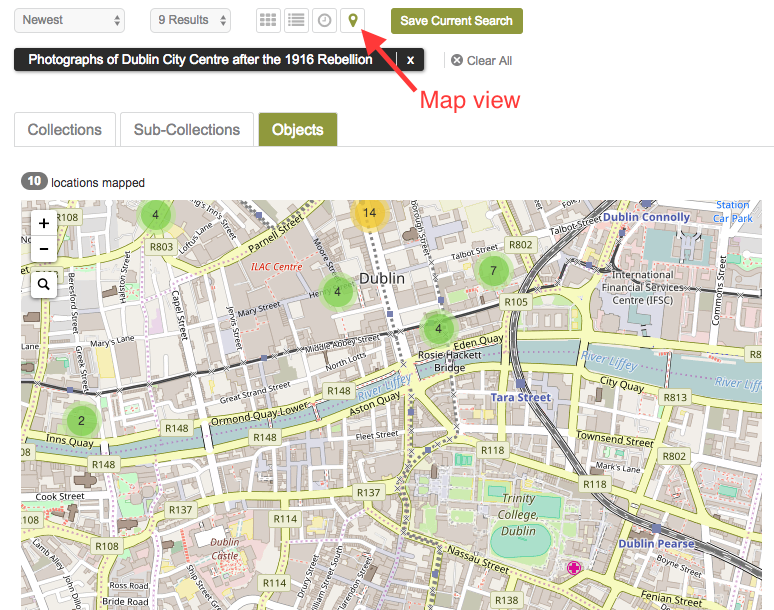
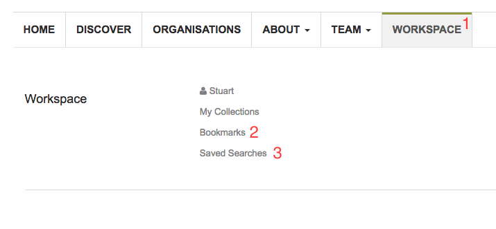

Tools
===========

This chapter describes the tools available within the Repository.

Mirador Viewer
-----------------
Another option for viewing images is to use the IIIF Mirador viewer. This is available for image
type assets that are publicly viewable. To launch the viewer click the IIIF icon in the object 
tools menu (1).

   Object tools.

The Mirador viewer allows you to zoom in on the image as well as perform image manipulation, such
as rotation, changing the brightness or contrast etc. Documentation on how to use the viewer can be
found at http://projectmirador.org/.

Alternatively if you already have an instance of Mirador open you can drag and drop the IIIF icon
into the viewer to have it load the image.

Mapping
---------
There are two different ways to view objects on the map view. If you are viewing a single object
whose metadata contains geodata a map link will be available under the object tools (2) menu. Clicking
this will display the location in a map modal.

To view all the objects in a collection on a map you can follow the 'All' objects link (1) in the 
collection display and then use the view mode selection to switch to the map view.

   Collection display page.

   View results in map mode.

Workspace
-----------
Once logged in you will now have access to the workspace page (1). This page allows you to view any bookmarks
or saved searches that you have created. To bookmark a collection or object you can click 'Bookmark Object' in the 
object tools menu. You can remove the bookmark by clicking again. Use the 'Manage Bookmarks' (2) link on 
the workspace page to view your bookmarked objects.

   Workspace page.

When you perform a search using the search box, at the top of the returned results you will see a button
to save the current search. You can view any saved searches by following 'Saved Searches' (3) from
your workspace. You can clear saved searches from this page also.

